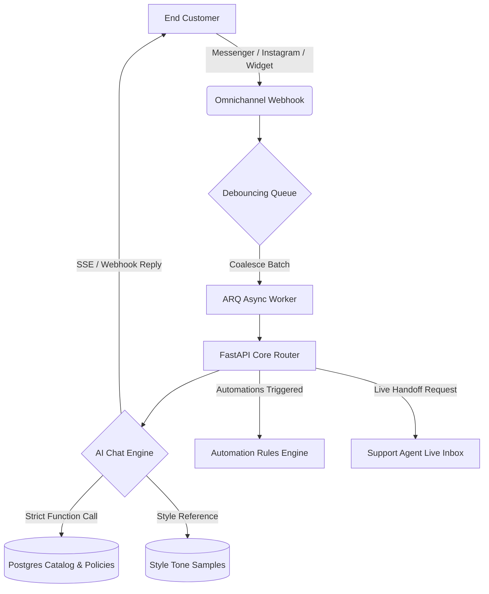

# Product Requirements Document (PRD)
## Project Name: chatter (AI-Powered Business Assistant Platform)
**Status**: Active / In Development  
**Target Audience**: Multi-tenant SaaS (Admins, Client Business Owners, Support Agents, End Customers)  
**Version**: 2.0.0  

---

## 1. Executive Summary & Value Proposition

### 1.1 Product Overview
**chatter** is a multi-tenant, cloud-based Software-as-a-Service (SaaS) platform that enables small-to-medium business owners (Clients) to deploy AI-powered customer service agents across their social media and web channels. The platform acts as a bridge between structured business intelligence (product catalogs, policies, FAQs) and dynamic customer communication, resolving queries instantly while maintaining absolute factual accuracy.

### 1.2 The Core Problem
Most AI support agents suffer from three critical bottlenecks:
1. **Hallucination**: Standard Large Language Models (LLMs) invent facts, prices, and policies when queried outside their immediate knowledge context, creating severe liability risks for businesses.
2. **Channel Fragmentation**: Customer inquiries pour in across Facebook Messenger, Instagram, WhatsApp, and websites, forcing business owners to juggle multiple applications.
3. **Impersonal Tone**: Generic AI agents lack the specific brand voice or local dialect representing the client's business.
4. **Ineffective Handoff**: When a customer complains or asks complex questions, automated systems fail to escalate the chat gracefully to a human agent, leading to customer churn.

### 1.3 Core Pillars of chatter
* **Zero-Hallucination AI**: Employs OpenAI function calling mapped to strictly-scoped database lookups. The AI model is physically restricted from answering catalog queries unless it fetches verified data from the database.
* **Unified Inbox & Omnichannel Hooking**: Syncs Facebook Messenger, Instagram, custom API webhooks, and an embeddable website widget into a cohesive messaging interface.
* **Brand Voice Training (AI Style)**: Processes uploaded chat logs (.txt, .json, .csv) to extract communication styles and custom vocabulary, allowing the AI to speak in the store owner's voice while keeping facts locked to database records.
* **Smart Handoff**: Seamlessly shifts execution from the AI agent to a live support dashboard whenever the customer requests a human, gets angry, or triggers a complex routing condition.
* **Rich No-Code Automations**: Provides a powerful trigger-condition-action workflow editor that runs on background task queues to trigger custom business logic on incoming webhooks.

---

## 2. Roles and Permissions Matrix

The platform is designed around four key user personas:

| Role | Provisioning Method | Key Capabilities |
| :--- | :--- | :--- |
| **System Admin** | Created on database bootstrap (first registered account) or via command-line scripts. | <ul><li>Access platform-wide operational statistics (total clients, sessions, channels).</li><li>Create and disable subscriber/client accounts.</li><li>Override and set custom client AI persona behavior and prompts.</li><li>Review any client's product catalogs and historic chat sessions.</li><li>Set global API settings (rotate OpenAI keys, default model, debounce time, master prompts).</li><li>Monitor pricing/token simulation metrics.</li></ul> |
| **Client / Tenant** | Registered by System Admin or via standard signup. | <ul><li>Configure business catalog (products, variants, category nodes, specific store policies).</li><li>Upload style logs to train AI Voice.</li><li>Activate or deactivate channels (Instagram, Messenger, Web widget).</li><li>Configure time slots and view booking/appointment lists.</li><li>Manage no-code automation workflows.</li><li>Test AI behavior inside an interactive playground.</li></ul> |
| **Support Agent** | Created by Clients under their respective tenants. | <ul><li>Access the Handoff Live Inbox to answer customer queries.</li><li>Take over conversations from active AI agents.</li><li>Add session notes and close handoff tickets.</li></ul> |
| **End-Customer** | External guest users messaging the client. | <ul><li>Query products, pricing, delivery, and policies via Messenger, Instagram, or Web widget.</li><li>Receive text, audio, and visual responses.</li><li>Book appointment slots and receive automated confirmations.</li></ul> |

---

## 3. Functional Specifications

### 3.1 Authentication & Multi-Tenancy
* **Data Isolation**: A shared-database multi-tenancy model. Every table containing client-sensitive data (`items`, `chat_sessions`, `automation_rules`, `bookings`, `time_slots`) must enforce a strict `user_id` foreign key check corresponding to the tenant owner.
* **JWT-Based Authentication**: Access tokens are signed using a secure algorithm (HS256) with custom claims including `role` and `token_version` to support instant global logout or password reset session invalidation.
* **Onboarding Flow**: Newly registered client accounts go through an onboarding wizard to input basic store categories, name, and choose a business template (e.g., Retail, Restaurant, Professional Services).

### 3.2 Product Catalog & Knowledge Management
* **Item Catalog**: Structure supporting product names, descriptions, categories, price points, and status (active/inactive).
* **Multi-Variant Support**: Items link to variants modeling attributes such as sizes, colors, and inventory states.
* **Media Uploads**: Secure image upload capability (`POST /api/items/{id}/image`) that validates MIME types and file extensions (capped at 20MB). Uploads are stored under isolated directories `/uploads/{user_id}/` and served via tokenized/session-guarded paths.
* **Pricing Policies & Store Information**: Dedicated models for shipping areas, return policies, and location details, making them searchable by the AI tool lookup.

### 3.3 Core AI Chat Engine & Hallucination Prevention
* **Factual Grounding Loop**: The agent utilizes OpenAI's function calling interface. The model has access to four read-only tools:
  1. `get_all_items()`
  2. `search_items(query)`
  3. `get_item_details(item_id)`
  4. `get_categories()`
* **Prompt Isolation**: System instructions explicitly forbid answering catalog or store questions unless the model has successfully run one of these tools in the current turn. If database tools yield empty sets, the system returns a fixed JSON `{"result": "no items found"}`, preventing the LLM from synthesizing speculative answers.
* **Style-Only Tone Injection**: Style datasets uploaded by clients are fed into the system prompt strictly as style guidelines (dialect, greeting conventions, sentence structures). The system prompt enforces a hard rule: *No factual claims, product names, or pricing may be extracted from the style samples.*
* **4-Mode Configuration**: Clients can configure the AI prompt engine into four distinct execution modes:
  * **Default**: standard helpful business assistant.
  * **Creative**: friendly, expressive, and conversational.
  * **Strict**: direct, precise, minimizing fluff.
  * **Custom**: fully override prompt directives.
* **Multimodal Inputs**: The engine processes inbound text, images (using GPT-4o vision to analyze customer product screenshots), and audio.
* **Voice replies & TTS**: Supports converting text responses into speech using OpenAI TTS. Users can enable voice replies, select specific voices, and choose voice settings. The audio files are persisted and streamed via custom Server-Sent Events (SSE) using the `audio` event standard.
* **Audio Transcription**: Inbound audio files (.m4a, .mp3, .wav, .ogg up to 25MB) are transcribed via OpenAI Whisper before processing in the main chat pipeline.

### 3.4 Omnichannel Integrations
* **Inbound Message Debouncing**: To handle customers sending multiple short, consecutive messages (e.g., "Hi" followed by "How much is the" followed by "Jacket?"), incoming webhooks push a job to Redis. The job is debounced for a configurable period (default: 8 seconds). Subsequent messages within this window reset the timer. Only the final debounced task runs the LLM call, processing all concatenated messages at once.
* **Integration Channels**:
  * **Meta Channel Suite**: Supports Official Facebook Messenger and Instagram integration. Includes a custom integration request pipeline: Clients submit their page links and details, and admins configure/validate the webhooks (with options to generate unique target URLs for ManyChat redirects).
  * **Generic API Webhook**: Synchronous request-response endpoint (`POST /api/webhooks/generic/{public_id}`) allowing third-party services to query the bot.
  * **Embeddable Chat Widget**: Provides an auto-generated script (`/api/widget/{public_id}.js`) that injects a styled floating chat bubble into any client website. The widget communicates with the backend via a secure public webhook route.

### 3.5 Automation Rules Engine
Replaces traditional hardcoded workflows with a modular, no-code trigger-condition-action workflow engine.
* **Triggers (20+)**: Detects conditions such as `new_message`, `angry_customer`, `low_confidence`, `hallucination_risk`, `product_not_found`, `outside_hours`, `keyword_detected`, and `whatsapp_24h_expired`.
* **Conditions (15+)**: Allows logical combinations evaluating message parameters, time, sentiment, category checks, and customer status.
* **Actions (20+)**: Executes functions like sending an automated message, triggering human handoff, calling external webhooks, scheduling bookings, tagging chats, or setting variables.
* **Execution Logs**: The system records an audit trail for every execution run (`AutomationRun` & `AutomationLog`) including time, conditions evaluation, matching logs, and execution errors.

### 3.6 Human Handoff & Live Inbox
* **Handoff Triggers**: Escalations occur automatically if:
  1. The customer explicitly requests a human agent.
  2. The LLM confidence score falls below a set threshold.
  3. The sentiment analyzer flags high customer frustration/anger.
  4. An automation rule triggers a handoff action.
* **Agent Portal**: A live chat inbox interface where support agents can:
  * View active tickets and historic chat transcripts.
  * Pause/resume the AI auto-responder for specific sessions.
  * Take over the chat to send messages directly back to the customer channel.
  * Add private session notes.

### 3.7 Appointment Booking & Time Slots
* **Weekly Availability**: Clients set active weekly time slot parameters (`TimeSlot` model) specifying active days (0 = Monday ... 6 = Sunday), start/end times, slot durations (e.g., 30 mins), and max parallel bookings.
* **Appointment Tracking**: Customers can check slot availability and schedule bookings through the AI agent. Bookings track customer name, phone number, date, time, and status (`pending`, `confirmed`, `cancelled`, `completed`).

### 3.8 Platform Administration Dashboard
* **Usage Statistics**: Dynamic indicators charting active client registration, message logs count, channel distribution, and catalog inventory size.
* **Subscriber Directory**: Central management table to create new tenants, activate/disable accounts, alter subscription configurations, change tenant passwords, and review integration queues.
* **OpenAI Cost/Token Simulator**: A calculator for admins to simulate costs based on models (e.g., `gpt-4o`, `gpt-4o-mini`), input/output token counts, and request volume.
* **Global Param Override**: Real-time DB settings that override `.env` parameters without server restarts, controlling platform model choice, global api keys, and debounce time parameters.

---

## 4. Non-Functional & Technical Requirements

### 4.1 Technology Stack
* **Backend Framework**: FastAPI (Python 3.11) utilizing asynchronous SQLAlchemy 2 and Alembic for automated migrations.
* **Database**: PostgreSQL 16 serving as the core transactional engine.
* **Caching & Queue**: Redis paired with the ARQ async worker framework to handle debouncing and message delivery.
* **Frontend**: Next.js 14+ (App Router) combined with Tailwind CSS for layout, Framer Motion for responsive animations, and Zustand for global state management.
* **Deployment & Networking**: Docker Compose configuring multi-worker Uvicorn setups, with Caddy routing traffic and managing Let's Encrypt SSL certificates automatically.

### 4.2 Security Requirements
* **Memory Protection**: A dedicated security middleware intercepts request headers and rejects oversized body sizes early (e.g., >25MB) to protect worker nodes from memory exhaustion.
* **CORS & Headers**: Restricts cross-origin resource sharing to white-listed domains. Emits secure headers including `X-Content-Type-Options: nosniff`, `X-Frame-Options: DENY`, and restrictive `Permissions-Policy` scopes.
* **Rate Limiting**: Redis-backed rate limit guards are applied strictly across routes, with high severity checks applied on authentication entry points (`/api/auth/login`, `/api/auth/register`).

### 4.3 High Performance & Reliability
* **Off-Request Processing**: All third-party external calls (Meta Webhook replies, Whisper transcribing, OpenAI TTS synthesis) must execute within background worker threads (`worker.py`) to prevent FastAPI request blockages.
* **Database Pool Guard**: Connection pool size optimized to `pool_size=20` and `max_overflow=40` to maintain performance during spikes in channel webhook volume.

---

## 5. Verification and Testing Plan

### 5.1 Automated Testing
* Run backend regression checks using `pytest` to validate:
  * Authentication scopes and tenant isolation.
  * Prompt mode configurations.
  * Zero-hallucination guardrails (verifying tool execution triggers).
  * Webhook routing and message debouncing queues.

### 5.2 Manual Verification
* Utilize the local [widget-test.html](file:///c:/Users/GTX/OneDrive/Documents/GitHub/va/widget-test.html) file to test widget embedding.
* Perform Meta webhook validation tests using mock payloads via Swagger UI at `/api/docs`.
* Verify SSE voice reply streaming inside the React admin interface.
